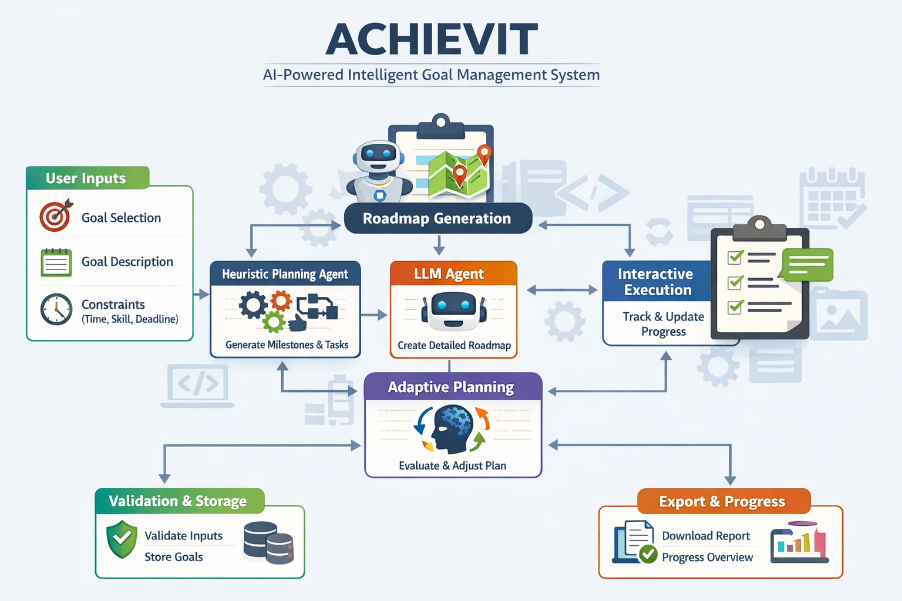

# ACHIEVIT  
**An LLM-Powered System for Planning, Executing, Tracking,  and Achieving Goal Resolution**

---

## Description

**ACHIEVIT** is an AI-driven, adaptive planning system designed to help **students and researchers structure, execute, and complete academic goals**.

It supports tasks such as preparing for exams, completing assignments, and writing dissertations or theses, while explicitly accounting for **real-world constraints** such as:

- Available study time  
- Skill level  
- Fixed deadlines  

By combining **deterministic heuristic planning** with **LLM-based reasoning**, ACHIEVIT produces **structured, realistic, and adaptive plans** that evolve as users make progress. Goals are broken into stable milestones and executable subtasks, progress is tracked transparently, and plans are dynamically adapted to maximize the likelihood of completion.

  

---

## Architecture & Key Features

### Hybrid Intelligence Architecture

ACHIEVIT follows a **layered, human-in-the-loop architecture** that combines rule-based structure with LLM intelligence.

  

### 1. Heuristic Logic Layer
- Detects goal type (Exam, Assignment, Dissertation / Thesis)
- Generates **deterministic and auditable milestones**
- Produces structured, milestone-specific subtasks
- Incorporates constraints:
  - Daily hours available
  - Skill level (Novice / Intermediate / Expert)
  - Deadline proximity

### 2. LLM Reasoning Layer (Gemini)
- Interprets execution data and progress signals
- Produces **context-aware, adaptive guidance**
- Re-prioritizes effort as deadlines approach
- Issues warnings when progress lags behind schedule
- Suggests targeted learning resources only when relevant

This hybrid approach ensures plans remain **stable, feasible, and intelligent**, avoiding hallucinated structure while still benefiting from LLM reasoning.

---

## Key Features & How It Works

### 🎯 Goal-Oriented Planning

ACHIEVIT supports multiple academic goal types:

- **Exams**
- **Assignments**
- **Dissertations / Theses**

For each goal, the system:

- Accepts a high-level user goal
- Generates **four fixed milestones**
- Assigns **five executable subtasks per milestone**
- Factors in:
  - Daily time commitment
  - User skill level
  - Fixed deadlines
- Produces **realistic, milestone-based execution plans**
- Tracks completion at the **subtask level**
- Dynamically adapts plans based on actual user progress
- Analyses deadline risk and alerts users when they fall behind
- Recommends strategies and academic resources aligned with pending work

---

### 🧑‍🤝‍🧑 Human-in-the-Loop Interface

- Built with **Streamlit** for fast, interactive iteration
- Sidebar-driven goal and constraint input
- Single column execution layout:
  - Milestone and subtask execution (checkbox matrix)
  - Plan overview, progress, and downloads of plans as docx
- Users remain in full control of:
  - Goal definition
  - Progress updates
  - Plan adaptation decisions
---
## 🔗 Live System

👉 **[Try the Live Demo Here](https://achievit.streamlit.app/)**

## Target Users

- Undergraduate and postgraduate students  
- Graduate researchers and PhD candidates  
- Self-directed learners with academic goals  

---
## OPIK Observability and evaluation

## Observability
- Total number of Trace logged: 432
- Total Errors: 72 errors due to
	- API free tier exhaustion
	- Server overload
- Total Cost logged traces: $2.569 
- P50 Average Latency: 35.9s

## Evaluation Result: LLM-as-a-Judge
- Evaluated Models: Google Gemini-3
- Judge: OpenAI GPT-4o
- Metrics: AnswerRelevance, Hallucination, Moderation
- Size of Dataset: 15 (Custom dataset)
- Basis of Test and Evaluation: 
	- Prompt version 1 vs Prompt version 2
	- Gemini-3-flash-preview vs Gemini-3-pro-preview

- Results: Prompt Optimisation Average scores based on 15 iterations

| Prompt       | Answer Relevance ↑ | Hallucination ↓ | Moderation | Latency ↓ | Total Tokens | Total Cost |
|-------------|-----------------|----------------|-----------|-----------|--------------|------------|
| Prompt v1   | 0.893           | 0.189          | 0.00      | 75.7s     | 9966.27      | $0.008     |
| Prompt v2   | 0.894           | 0.191          | 0.00      | 47.4s     | 9417.733     | $0.007     |
| Change (+/-)| +0.11%          | +1.06%         | 0.00%     | −37.38%   | −5.50%       | −12.50%    |

Using OPIK, Prompt-level experiments show that Prompt v2.0 as compared to prompt v1.0 increase answer relevance by +0.11%, reduces latency by -37% and cost by -12.5%. But prompt version v2.0 had more hallucination risk +1.06% than Prompt v1, enabling an informed efficiency–quality trade-off for real-world deployment

- Results: Model Optimisation Average scores based on 15 iterations

| Model           | Answer Relevance ↑ | Hallucination ↓ | Moderation | Latency ↓ | Total Tokens | Total Cost |
|-----------------|-----------------|----------------|-----------|-----------|--------------|------------|
| Gemini-3-flash  | 0.912           | 0.119          | 0.00      | 50.2s     | 9820.133     | $0.008     |
| Gemini-3-pro    | 0.753           | 0.273          | 0.00      | 60.3s     | 9914.867     | $0.033     |
| Change (+/-)    | −17.43%         | +129.41%       | 0.00%     | +20.12%   | +0.96%       | +312.50%   |

> **Note:** For code related to observability and LLM-based evaluations using OPIK, check the unmerged branch [`dev_opik_LLM`](https://github.com/Abdul-WriteCodes/ACHIEVIT/tree/dev_opik_llm).

---
## Local Installation & Setup

Follow the steps below to clone and run ACHIEVIT locally on your machine.
- Clone the Repository
	- git clone https://github.com/abdul-writecodes/ACHIEVIT.git
	- cd achievit
- Create and Activate a Virtual Environment (Recommended)
- Windows
	- python -m venv venv
	- venv\Scripts\activate
- macOS / Linux
	- python3 -m venv venv
	- source venv/bin/activate
-	Install Dependencies
	- pip install -r requirements.txt
	- Configure Environment Variables
- Create a .streamlit/secrets.toml file in the project root:
	- GEMINI_API_KEY = "input_your_gemini_api_key_here"
	- OPIK_API_KEY = "input_your_opik_api_key_here"  # optional

Gemini API key can be obtained from Google AI Studio.
OPIK is optional but recommended for tracing, evaluation, and observability.

- Run the Application
	- streamlit run app.py
- Open your browser at:
	- http://localhost:8501

---
## Troubleshooting

Gemini API free tier limit exceeded or server overloaded
The free-tier Gemini model has request limits and reduced reasoning capacity. If the limit is exceeded or the server is overloaded, the app will prompt you to try again later or switch to a billed model.

- Missing dependencies
	- Re-run pip install -r requirements.txt
- Secrets not found
	- Ensure .streamlit/secrets.toml exists and is correctly formatted

---

## Disclaimer

ACHIEVIT does not collect or store personal data.  
All planning and progress tracking occur within the application session.

---

© 2026
